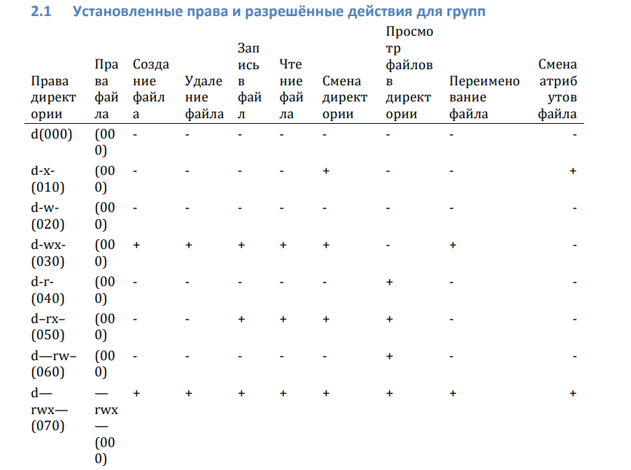
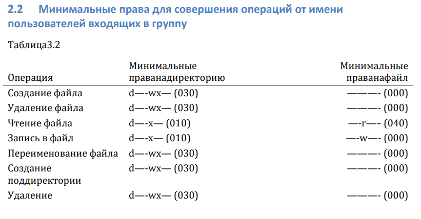

---
## Front matter
lang: ru-RU
title: Информационная безопасность компьютерных сетей
subtitle: Презентация к лабораторной работе № 3
author:
  - Еленга Невлора Люглеш
institute:
  - Российский университет дружбы народов, Москва, Россия
  - Факультет физико-математических и естественных наук, Москва, Россия
  - Кафедра прикладной информатики и теории вероятности, Москва, Россия
date: 17 сентября 2023

## i18n babel
babel-lang: russian
babel-otherlangs: english

## Formatting pdf
toc: false
toc-title: Содержание
slide_level: 2
aspectratio: 169
section-titles: true
theme: metropolis
header-includes:
 - \metroset{progressbar=frametitle,sectionpage=progressbar,numbering=fraction}
 - '\makeatletter'
 - '\beamer@ignorenonframefalse'
 - '\makeatother'
---

# Информация

## Докладчик

:::::::::::::: {.columns align=center}
::: {.column width="70%"}

  * Еленга Невлора Люглеш
  * Студент 4-го курса
  * Группа НКНбд-01-20
  * Российский университет дружбы народов
  * 1032201673
  * <>

:::
::: {.column width="30%"}

:::
::::::::::::::

## Актуальность

  - В Linux, как и в любой многопользовательской системе, абсолютно естественным образом возникает задача разграничения доступа субъектов — пользователей к объектам — файлам дерева каталогов.
 
 - Дискреционные механизмы разграничения доступа используются для разграничения прав доступа процессов как обычных пользователей, так и для ограничения прав системных программ в (например, служб операционной системы), которые работают от лица псевдопользовательских учетных записей.   

## Цели и задачи

 Получение практических навыков работы в консоли с атрибутами файлов для групп пользователей.
   

## Материалы и методы

- VirtualBox 
- Centos   

## Содержание исследования

- Создание Двух пользователя 
- дополнение таблица    
- Создание markdown отчета    

## Результаты

{#fig:001 width=70%}

{#fig:001 width=70%}

## Выводы

 В ходе выполнения лабораторной работы мы смогли приотобести практические навыки работы в консоли с атрибутами файлов для групп пользователей.
  

 

