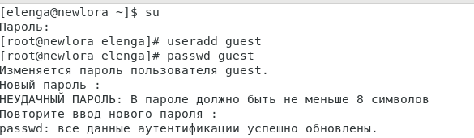
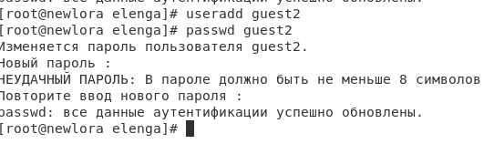
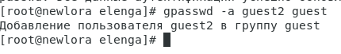
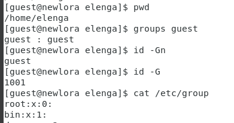
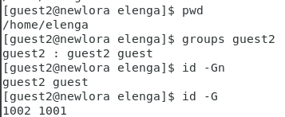
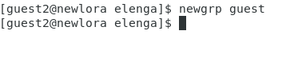
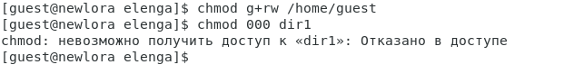
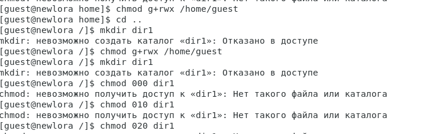
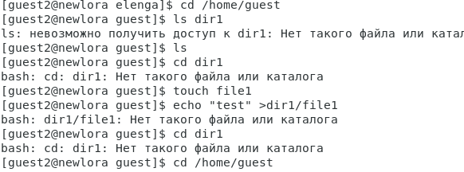

---
## Front matter
title: "Отчёт по лабораторной работе 3"
subtitle: "Простейший вариант "
author: "Еленга Невлора Люглеш"

## Generic otions
lang: ru-RU
toc-title: "Содержание"

## Bibliography
bibliography: bib/cite.bib
csl: pandoc/csl/gost-r-7-0-5-2008-numeric.csl

## Pdf output format
toc: true # Table of contents
toc-depth: 2
lof: true # List of figures
lot: true # List of tables
fontsize: 12pt
linestretch: 1.5
papersize: a4
documentclass: scrreprt
## I18n polyglossia
polyglossia-lang:
  name: russian
  options:
	- spelling=modern
	- babelshorthands=true
polyglossia-otherlangs:
  name: english
## I18n babel
babel-lang: russian
babel-otherlangs: english
## Fonts
mainfont: PT Serif
romanfont: PT Serif
sansfont: PT Sans
monofont: PT Mono
mainfontoptions: Ligatures=TeX
romanfontoptions: Ligatures=TeX
sansfontoptions: Ligatures=TeX,Scale=MatchLowercase
monofontoptions: Scale=MatchLowercase,Scale=0.9
## Biblatex
biblatex: true
biblio-style: "gost-numeric"
biblatexoptions:
  - parentracker=true
  - backend=biber
  - hyperref=auto
  - language=auto
  - autolang=other*
  - citestyle=gost-numeric
## Pandoc-crossref LaTeX customization
figureTitle: "Рис."
tableTitle: "Таблица"
listingTitle: "Листинг"
lofTitle: "Список иллюстраций"
lotTitle: "Список таблиц"
lolTitle: "Листинги"
## Misc options
indent: true
header-includes:
  - \usepackage{indentfirst}
  - \usepackage{float} # keep figures where there are in the text
  - \floatplacement{figure}{H} # keep figures where there are in the text
---

# Цель работы

Получение практических навыков работы в консоли с атрибутами файлов для групп пользователей.

# Выполнение лабораторной работы

 1.В установленной операционной системе создаем учётную запись пользователя guest(использую учётную запись администратора):

 2.Задаем пароль для пользователя guest(использую учётную запись администратора):

{#fig:001 width=70%}

3.Аналогично создайте второго пользователя guest2.

{#fig:001 width=70%}

 
4.Добавьте пользователя guest2 в группу guest:

{#fig:001 width=70%}

5.Осуществите вход в систему от двух пользователей на двух разных консолях:guest напервой консолии guest2 навторой консоли. 

6.Для обоих пользователей командой pwd определим директорию,в которой вынаходитесь.и сравним её с приглашениями командной строки. 

7.Уточним имя  пользователя,его группу,кто входит в неё ик каким группам принадлежитонсам.

8.Сравним полученную информацию с содержимым файла /etc/group. Просмотрите файл командой

{#fig:001 width=70%}

9.Отименим пользователя guest2 и выполним регистрацию пользователя guest2 в группе guest командой

{#fig:001 width=70%}

{#fig:001 width=70%}

10.Отименим пользователя guest и изменим права директории /home/guest, разрешив все действия для пользователей группы:

11.Отименим пользователя guest и снимим с директории /home/guest/dir1 все атрибуты командой

{#fig:001 width=70%}

табл.3.1. На основании заполненной таблицы и определим теилииные минимально необходимые права для выполнения пользователем guest2 операций внутри директории dir1 и заполните табл.3.2.

{#fig:001 width=70%}

{#fig:001 width=70%}

## Установленные права и разрешённые действия для групп

|Права директории | Права файла|Создание файла |Удаление файла|Запись в файл|Чтение файла|Смена директории|Просмотр файловв директории|Переименование файла|Смена атрибутов файла|
| :--- |:--- |:--- |:--- |:--- |:--- |:--- |:--- |:--- | ---: |
|d(000) |(000)| - | - | - | - | - | - | - | - |
|d-x-(010) |(000)| - | - | - | - | + | - | - | + |
|d-w-(020) |(000)| - | - | - | - | -| - | - | - |
|d-wx-(030) |(000)| + | + | + | + | + | - | + | - |
|d-r-(040) |(000)| - | - | - | - | - | + | - | - |
|d--rx--(050) |(000)| - | - | + | + | + | + | - | - |
|d---rw--(060) |(000)| - | - | - | - | - | + | - | - |
|d---rwx---(070) |---rwx---(000)| +| + | + | + | + | + | + | + |

## Минимальные права для совершения операций от имени пользователей входящих в группу
Таблица3.2 

|Операция|Минимальные праванадиректорию|Минимальные праванафайл|
| :--- | :--- | ---: |
|Создание файла| d----wx--- (030) | ---------- (000)|
|Удаление файла| d----wx--- (030)| ---------- (000)|
|Чтение файла| d----x--- (010)| ----r----- (040)|
|Запись в файл| d----x--- (010)| ----w---- (000)|
|Переименование файла| d----wx--- (030)| ---------- (000)|
|Создание поддиректории| d----wx--- (030)| ---------- (000)|
|Удаление поддиректории| d----wx--- (030)| ---------- (000)|

# Выводы

  В ходе выполнения лабораторной работы мы смогли приотобести практические навыки работы в консоли с атрибутами файлов для групп пользователей.

