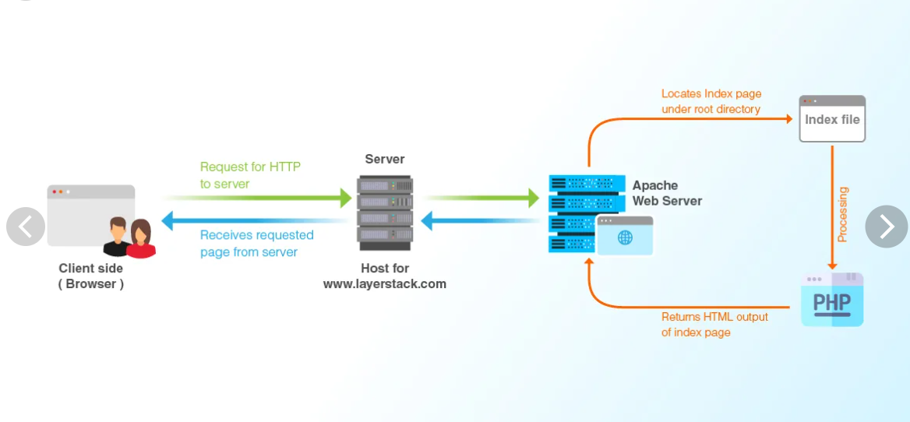
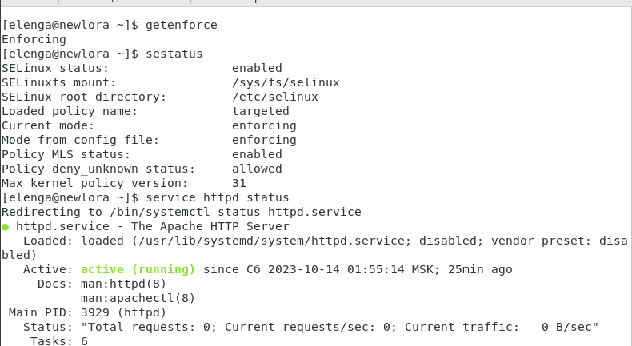
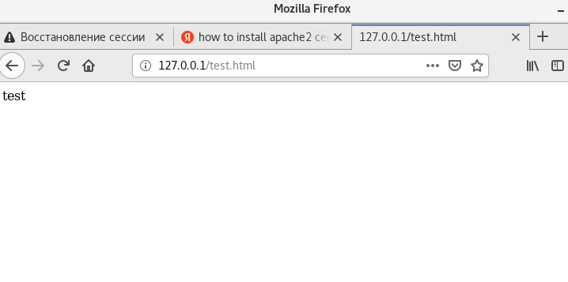
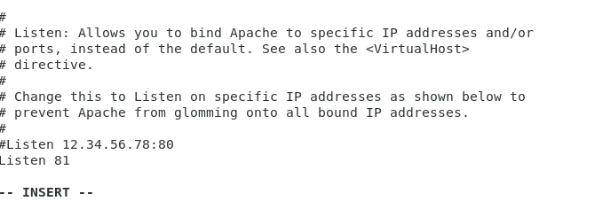
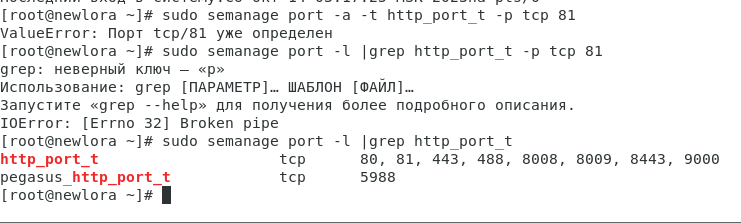
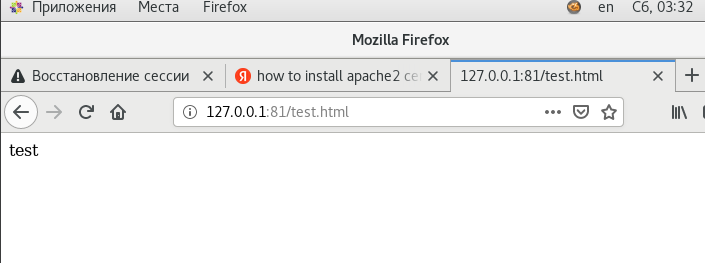

---
## Front matter
lang: ru-RU
title: Информационная безопасность компьютерных сетей
subtitle: Презентация к лабораторной работе № 6
author:
  - Еленга Невлора Люглеш
institute:
  - Российский университет дружбы народов, Москва, Россия
  - Факультет физико-математических и естественных наук, Москва, Россия
  - Кафедра прикладной информатики и теории вероятности, Москва, Россия
date: 09 сентября 2023

## i18n babel
babel-lang: russian
babel-otherlangs: english

## Formatting pdf
toc: false
toc-title: Содержание
slide_level: 2
aspectratio: 169
section-titles: true
theme: metropolis
header-includes:
 - \metroset{progressbar=frametitle,sectionpage=progressbar,numbering=fraction}
 - '\makeatletter'
 - '\beamer@ignorenonframefalse'
 - '\makeatother'
---

# Информация

## Докладчик

:::::::::::::: {.columns align=center}
::: {.column width="70%"}

  * Еленга Невлора Люглеш
  * Студент 4-го курса
  * Группа НКНбд-01-20
  * Российский университет дружбы народов
  * 1032201673
  * <>

:::
::: {.column width="30%"}

:::
::::::::::::::

## Актуальность

   Веб-сервер Apache – это программное обеспечение, которое установлено на сам сервер. Как мы уже поняли, благодаря ему устанавливается соединение между юзером, использующим браузер, и сервером, чтобы осуществить передачу данных при запросе. Пользователь переходит на страницу, далее отправляется сигнал на обработку, Apache находит необходимые данные и возвращает их пользователю, чтобы тот смог ознакомиться с ними.

{#fig:001 width=70%}
 
## Цели и задачи

- Развить навыки администрирования ОСLinux
- Получить первое практическое знакомствос технологией SELinux1
- Подготовка лабораторного стенда     
- Проверить работу SELinx  напрактике совместно с веб-сервером Apache

## Материалы и методы

- VirtualBox    
- Centos   
- Веб-сервер Apache

## Результаты

1.Вошли в систему с полученными учётными данными и убедились,что SELinux работает  в режиме enforcing  политики targeted с помощью команд getenforce и sestatus.

{#fig:001 width=70%}

11.Обратились к файлу через веб-сервер,введя в браузере адрес http://127.0.0.1/test.html.Убедитесь,что файл был успешно отображён.

{#fig:001 width=70%}

{#fig:001 width=70%}

14.Попробовали ещё разполучить доступ к файлу через веб-сервер,введяв браузере адрес http://127.0.0.1/test.html.

 Получили сообщение обошибке:

{#fig:001 width=70%}

16.Запустили веб-сервер Apache на прослушивание ТСР-порта 81(ане80,как рекомендует IANA и прописанов/etc/services).Для этого в файле/etc/httpd/httpd.conf найдите строчку Listen 80и заменили её на Listen 81. 

{#fig:001 width=70%}

17.Выполнили перезапуск веб-сервера Apache.

{#fig:001 width=70%}

{#fig:001 width=70%}

## Вывод

   В ходе выполнения лабораторной работы мы получили первое практическое знакомствос технологией SELinux1. Проверили работу SELinx  напрактике совместно с веб-сервером Apache.

