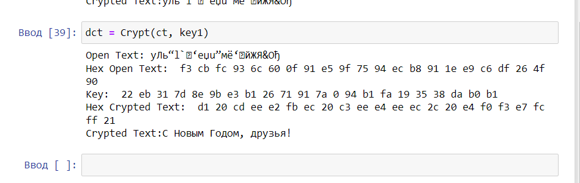
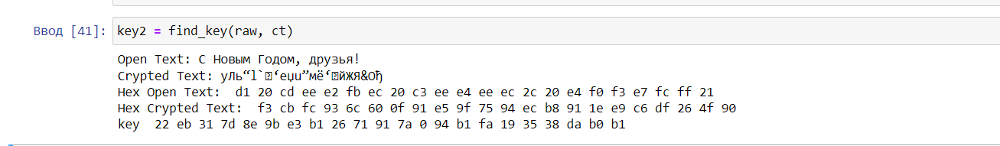
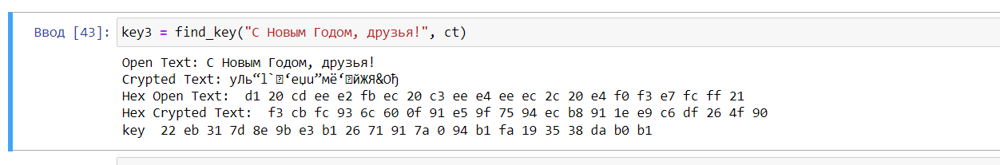

---
## Front matter
title: "Отчёт по лабораторной работе 7"
subtitle: "Простейший вариант "
author: "Еленга Невлора Люглеш"

## Generic otions
lang: ru-RU
toc-title: "Содержание"

## Bibliography
bibliography: bib/cite.bib
csl: pandoc/csl/gost-r-7-0-5-2008-numeric.csl

## Pdf output format
toc: true # Table of contents
toc-depth: 2
lof: true # List of figures
lot: true # List of tables
fontsize: 12pt
linestretch: 1.5
papersize: a4
documentclass: scrreprt
## I18n polyglossia
polyglossia-lang:
  name: russian
  options:
	- spelling=modern
	- babelshorthands=true
polyglossia-otherlangs:
  name: english
## I18n babel
babel-lang: russian
babel-otherlangs: english
## Fonts
mainfont: PT Serif
romanfont: PT Serif
sansfont: PT Sans
monofont: PT Mono
mainfontoptions: Ligatures=TeX
romanfontoptions: Ligatures=TeX
sansfontoptions: Ligatures=TeX,Scale=MatchLowercase
monofontoptions: Scale=MatchLowercase,Scale=0.9
## Biblatex
biblatex: true
biblio-style: "gost-numeric"
biblatexoptions:
  - parentracker=true
  - backend=biber
  - hyperref=auto
  - language=auto
  - autolang=other*
  - citestyle=gost-numeric
## Pandoc-crossref LaTeX customization
figureTitle: "Рис."
tableTitle: "Таблица"
listingTitle: "Листинг"
lofTitle: "Список иллюстраций"
lotTitle: "Список таблиц"
lolTitle: "Листинги"
## Misc options
indent: true
header-includes:
  - \usepackage{indentfirst}
  - \usepackage{float} # keep figures where there are in the text
  - \floatplacement{figure}{H} # keep figures where there are in the text
---

# Цель работы

  Освоить на практике применение режима одно кратного гаммирования .

# Алтуальность

Шифрование в режиме однократного гаммирования – это один из методов симметричного шифрования, который используется для защиты информации от несанкционированного доступа. 

# Выполнение лабораторной работы

1.Определили вид шифро текст а при известном ключе и известном открытом тексте.

- Код
```
  import numpy as np 

  def gen_key(text):
    rn = np.random.randint(0, 255, len(text))
    key = [hex(e)[2:] for e in rn]

    return key

  def Crypt(open_text, key):
    print(f"Open Text: {open_text}")
    hex_open_text = []
    for ch in open_text:
        hex_open_text.append(ch.encode("cp1251").hex())

    print("Hex Open Text: ", *hex_open_text)

    
    print("Key: ", *key)
    hex_crypted_text = []
    for i in range(len(hex_open_text)):
        hex_crypted_text.append("{:02x}".format(int(key[i], 16)^int(hex_open_text[i], 16)))

    print("Hex Crypted Text: ", *hex_crypted_text)
    crypted_text = bytearray.fromhex("".join(hex_crypted_text)).decode("cp1251")
    print(f"Crypted Text:{crypted_text}")

    return  crypted_text
```
- Результаты

 {#fig:001 width=70%}


{#fig:001 width=70%}


2.Определили ключ,спомощью которого шифро текст может быть преобразован в некоторый фрагмент текста,представляющий собой один из возможных вариантов прочтения открытого текста.

```
def find_key(open_text, crypted_text):
    print(f"Open Text: {open_text}\nCrypted Text: {crypted_text}")
    hex_open_text = []
    for ch in open_text:
        hex_open_text.append(ch.encode("cp1251").hex())

    hex_crypted_text = []
    for ch in crypted_text:
        hex_crypted_text.append(ch.encode("cp1251").hex())

    print("Hex Open Text: ", *hex_open_text)
    print("Hex Crypted Text: ", *hex_crypted_text)
    key = [hex(int(i,16)^int(j,16))[2:] for (i,j) in zip(hex_open_text, hex_crypted_text)]
    print("key ", *key)

    return key

```
{#fig:001 width=70%}

{#fig:001 width=70%}


## Контрольные вопросы

1.Поясните смысл одно кратного гаммирования. 

С точки зрения теории криптоанализа метод шифрования однократной случайной равновероятной гаммой той же длины ("однократное гаммирование"), что и открытый текст, является невскрываемым. Обоснование, которое привел Шеннон, основываясь на введенном им же понятии информации, не дает возможности усомниться в этом - из-за равных априорных вероятностей криптоаналитик не может сказать о дешифровке, верна она или нет. Кроме того, даже раскрыв часть сообщения, дешифровщик не сможет поправить положение - информация о вскрытом участке гаммы не дает информации об остальных ее частях.

2.Недостатки одно кратного гаммирования. 

Первый недостаток данного метода – это необходимость использования случайного ключа-гаммы для каждого сообщения. Если ключ-гамма повторяется или становится известен злоумышленнику, то метод становится небезопасным. Также, генерация сложных случайных последовательностей может привести к высоким требованиям к вычислительной мощности компьютера, что может создать сложности в процессе шифрования больших объемов данных.

Второй недостаток – это отсутствие защиты от целенаправленной атаки. При использовании шифрования в режиме однократного гаммирования злоумышленник может применить метод анализа частотности, при котором исследуется частота повторений определенных битов в шифротексте. Это может привести к открытию ключа-гаммы и расшифровке сообщения.

3.Преимущества одно кратного гаммирования.

Высокий уровень безопасности: Шифрование методом гаммирования с использованием случайной гаммы обеспечивает высокий уровень безопасности. При правильной реализации и использовании достаточно длинной и случайной гаммы, расшифровка сообщения без знания гаммы становится практически невозможной;
Отсутствие паттернов;
Высокая скорость шифрования и расшифрования.

 

6.Для того, чтобы получить зашифрованный текст достаточно сложить каждый символ открытого текста с символом гаммы. В качестве гаммы будет выступать символьная последовательность произвольной длины. В случае, если ее длина меньше длины текста, мы просто повторим последовательность нужное количество раз, чтобы хватило на зашифровку всего текста.

Расшифровка выполняется аналогичным образом. Складываем символы зашифрованного текста с символами гаммы и получаем открытый текст. 

8.Необходимые и достаточные условия абсолютной стойкости шифра:

·  полная случайность ключа;

·  равенство длин ключа и открытого текста;

·  однократное использование ключа.

# Вывод

  В ходе выполнения лабораторной работы мы освоили на практике применение режима одно кратного гаммирования.

