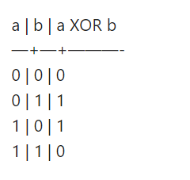
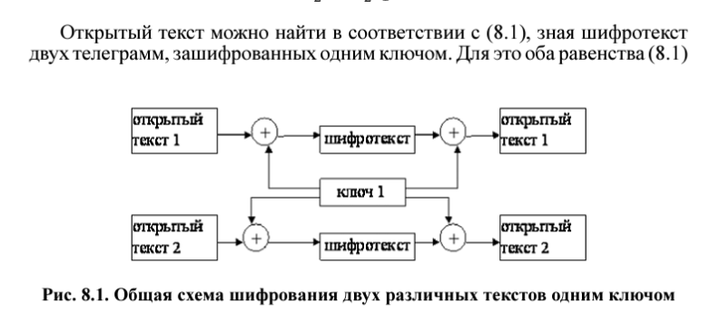
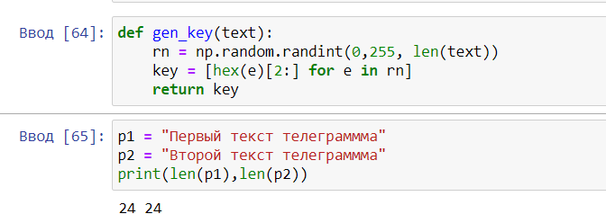
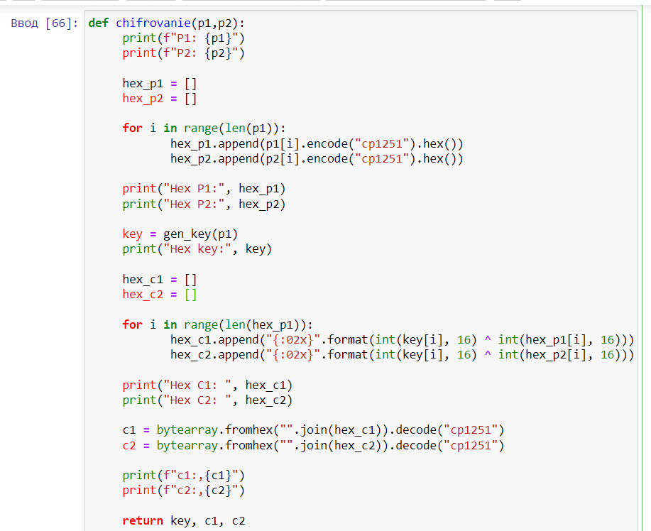
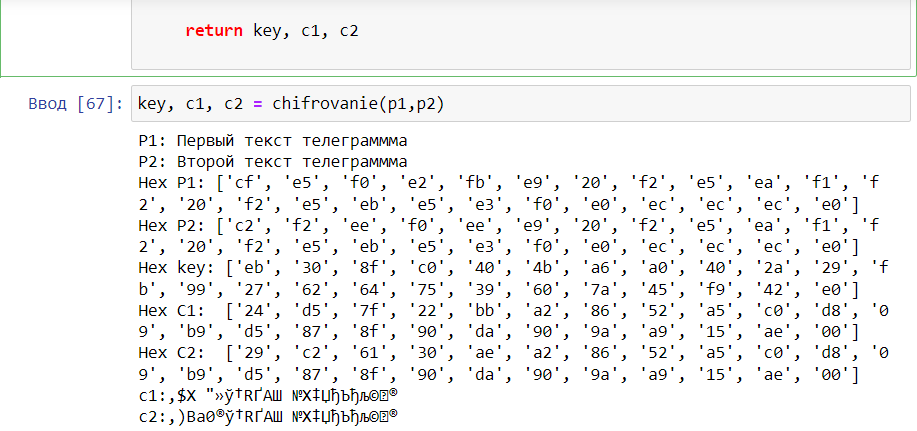
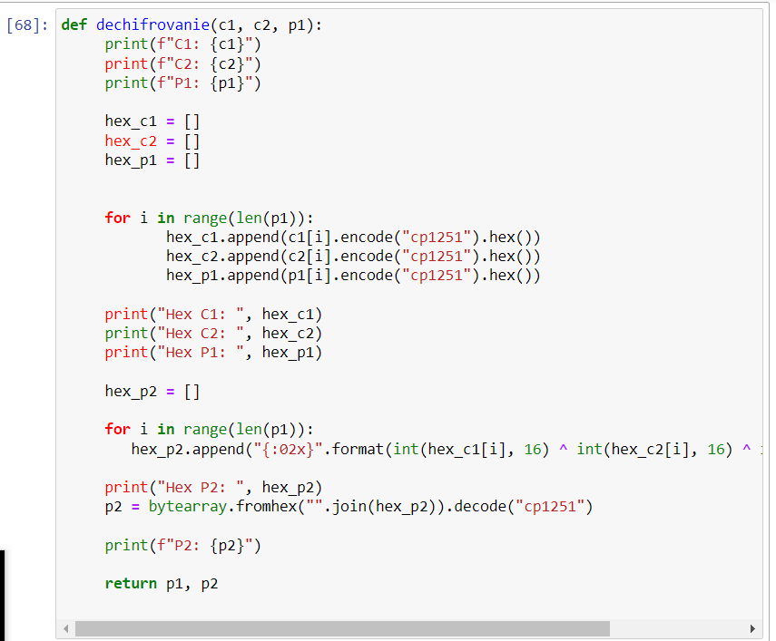
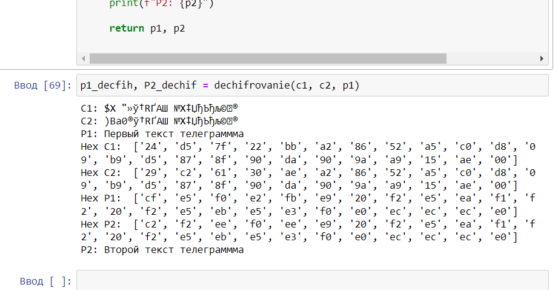

---
## Front matter
lang: ru-RU
title: Информационная безопасность компьютерных сетей
subtitle: Презентация к лабораторной работе № 8
author:
  - Еленга Невлора Люглеш
institute:
  - Российский университет дружбы народов, Москва, Россия
  - Факультет физико-математических и естественных наук, Москва, Россия
  - Кафедра прикладной информатики и теории вероятности, Москва, Россия
date: 21 октября 2023

## i18n babel
babel-lang: russian
babel-otherlangs: english

## Formatting pdf
toc: false
toc-title: Содержание
slide_level: 2
aspectratio: 169
section-titles: true
theme: metropolis
header-includes:
 - \metroset{progressbar=frametitle,sectionpage=progressbar,numbering=fraction}
 - '\makeatletter'
 - '\beamer@ignorenonframefalse'
 - '\makeatother'
---

# Информация

## Докладчик

:::::::::::::: {.columns align=center}
::: {.column width="70%"}

  * Еленга Невлора Люглеш
  * Студент 4-го курса
  * Группа НКНбд-01-20
  * Российский университет дружбы народов
  * 1032201673
  * <>

:::
::: {.column width="30%"}

:::
::::::::::::::

## Актуальность

   Гаммирование – это наложение (снятие) на открытые (зашифрованные) данные криптографической гаммы, то есть последовательности элементов данных, вырабатываемых с помощью некоторого криптографического алгоритма, для получения зашифрованных (открытых) данных.

   Шифрование в режиме однократного гаммирования – это один из методов симметричного шифрования, который используется для защиты информации от несанкционированного доступа. 

Шифрование в режиме однократного гаммирования – это метод симметричного шифрования, в котором побитово складывается (по модулю 2) открытый текст с ключом-гаммой. 

Ключ-гамма – это случайный битовый набор, который используется только для зашифрования одного сообщения и должен быть равен или более длинным, чем сам текст. Ключ-гамма порождается с помощью генератора случайных чисел и не должен быть известен злоумышленнику.

Как это работает?

Для шифрования в режиме однократного гаммирования мы используем операцию побитового XOR (исключающее ИЛИ), которая имеет следующую таблицу истинности:

{#fig:001 width=70%}
 
## Цели и задачи

- Освоить на практике применение режима однократного гаммирования .
- кодирования различных исходных текстов одним ключом.  
- Описание программы
- Запуск программы

## Постановка задачи

Необходимо разработать приложение,позволяющее шифровать и дешифровать тексты P1 и P2 в режиме однократного гаммирования.Приложение должно определить вид шифротекстов C1 и C2 обоих текстов P1 и P2 при известном ключе;Необходимо определить и выразить аналитически способ,прикоторомзлоу мышленник может прочитать оба текста,не зная ключа и не стремясь его определить.

## Материалы и методы

- Python
- Библотека Numpy

## Результаты

Режим шифрования однократного гаммирования одним ключом двух видов открытого текста реализуется в соответствии со схемой,приведённой на рис.8.1.

{#fig:001 width=70%}

- Генерация ключа

{#fig:001 width=70%}

- Шифрование Текста

{#fig:001 width=70%}

{#fig:001 width=70%}

{#fig:001 width=70%}

- Использовали C1, C2 , P1 для получения  P2 
{#fig:001 width=70%}

## Вывод

   В ходе выполнения лабораторной работы мы освоили на практике применение режима однократного гаммирования напримере кодирования различных исходных текстов одним ключом.

