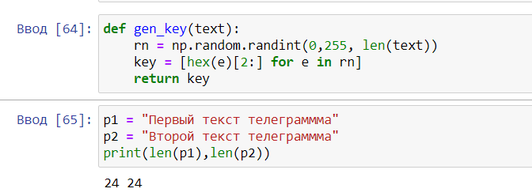
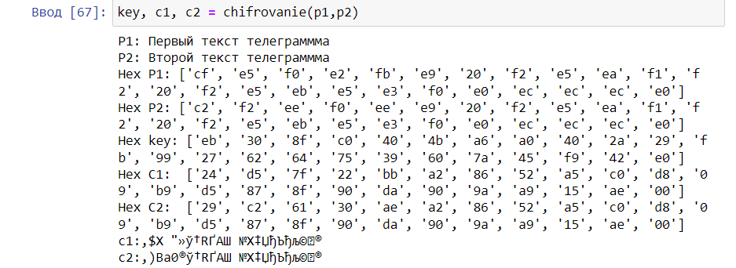
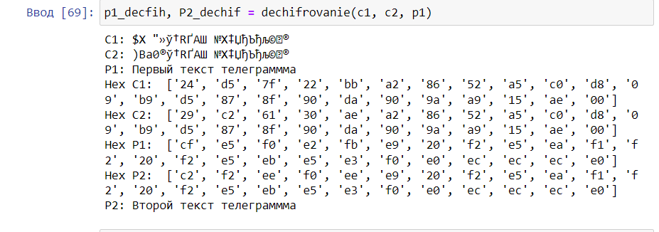

---
## Front matter
title: "Отчёт по лабораторной работе 8"
subtitle: "Простейший вариант "
author: "Еленга Невлора Люглеш"

## Generic otions
lang: ru-RU
toc-title: "Содержание"

## Bibliography
bibliography: bib/cite.bib
csl: pandoc/csl/gost-r-7-0-5-2008-numeric.csl

## Pdf output format
toc: true # Table of contents
toc-depth: 2
lof: true # List of figures
lot: true # List of tables
fontsize: 12pt
linestretch: 1.5
papersize: a4
documentclass: scrreprt
## I18n polyglossia
polyglossia-lang:
  name: russian
  options:
	- spelling=modern
	- babelshorthands=true
polyglossia-otherlangs:
  name: english
## I18n babel
babel-lang: russian
babel-otherlangs: english
## Fonts
mainfont: PT Serif
romanfont: PT Serif
sansfont: PT Sans
monofont: PT Mono
mainfontoptions: Ligatures=TeX
romanfontoptions: Ligatures=TeX
sansfontoptions: Ligatures=TeX,Scale=MatchLowercase
monofontoptions: Scale=MatchLowercase,Scale=0.9
## Biblatex
biblatex: true
biblio-style: "gost-numeric"
biblatexoptions:
  - parentracker=true
  - backend=biber
  - hyperref=auto
  - language=auto
  - autolang=other*
  - citestyle=gost-numeric
## Pandoc-crossref LaTeX customization
figureTitle: "Рис."
tableTitle: "Таблица"
listingTitle: "Листинг"
lofTitle: "Список иллюстраций"
lotTitle: "Список таблиц"
lolTitle: "Листинги"
## Misc options
indent: true
header-includes:
  - \usepackage{indentfirst}
  - \usepackage{float} # keep figures where there are in the text
  - \floatplacement{figure}{H} # keep figures where there are in the text
---

# Цель работы

  Освоить на практике применение режима однократного гаммирования напримере кодирования различных исходных текстов одним ключом.

# Алтуальность

Шифрование в режиме однократного гаммирования – это метод симметричного шифрования, в котором побитово складывается (по модулю 2) открытый текст с ключом-гаммой.

Режим шифрования однократного гаммирования одним ключом двух видов открытого текста реализуется в соответствии со схемой,приведённой на рис.8.1.

{#fig:001 width=70%}

# Постановка задачи

Исходные данные.

Две телеграммы Центра: 

P1=НаВашисходящийот1204 

P2=ВСеверныйфилиалБанка 

Ключ Центра длиной 20 байт:

 K=05 0C 17 7F 0E 4E 37 D2 94 10 09 2E 22 57 FF C8 OB B2 70 54

Два текста кодируются одним ключом(однократноегаммирование). Требуется не зная ключа и не стремясь его определить,прочитать оба текста.

Необходимо разработать приложение,позволяющее шифровать и дешифровать тексты P1 и P2 в режиме однократного гаммирования.Приложение должно определить вид шифротекстов C1 и C2 обоих текстов P1 и P2 при известном ключе;Необходимо определить и выразить аналитически способ,прикоторомзлоу мышленник может прочитать оба текста,не зная ключа и не стремясь его определить.

# Выполнение лабораторной работы

## Код

- Генерация ключа:

```
  import numpy as np

  def gen_key(text):
    rn = np.random.randint(0,255, len(text))
    key = [hex(e)[2:] for e in rn]
    return key

  p1 = "Первый текст телеграммма"
  p2 = "Второй текст телеграммма"
  print(len(p1),len(p2))

```

{#fig:001 width=70%}

- Шифрование и Дешифрование текстов P1 и P2 

```
 def chifrovanie(p1,p2):
     print(f"P1: {p1}")
     print(f"P2: {p2}")
    
     hex_p1 = []
     hex_p2 = []
     
     for i in range(len(p1)):
            hex_p1.append(p1[i].encode("cp1251").hex())
            hex_p2.append(p2[i].encode("cp1251").hex())
            
     print("Hex P1:", hex_p1)
     print("Hex P2:", hex_p2)
        
     key = gen_key(p1)
     print("Hex key:", key)
    
     hex_c1 = []
     hex_c2 = []
     
     for i in range(len(hex_p1)):
            hex_c1.append("{:02x}".format(int(key[i], 16) ^ int(hex_p1[i], 16)))
            hex_c2.append("{:02x}".format(int(key[i], 16) ^ int(hex_p2[i], 16)))
            
     print("Hex C1: ", hex_c1)
     print("Hex C2: ", hex_c2)
    
     c1 = bytearray.fromhex("".join(hex_c1)).decode("cp1251")
     c2 = bytearray.fromhex("".join(hex_c2)).decode("cp1251")
    
     print(f"c1:,{c1}")
     print(f"c2:,{c2}")
     
     return key, c1, c2
    
```

{#fig:001 width=70%}

```
   def dechifrovanie(c1, c2, p1):
     print(f"C1: {c1}")
     print(f"C2: {c2}")
     print(f"P1: {p1}")
    
     hex_c1 = []
     hex_c2 = []
     hex_p1 = []
     
     
     for i in range(len(p1)):
            hex_c1.append(c1[i].encode("cp1251").hex())
            hex_c2.append(c2[i].encode("cp1251").hex())
            hex_p1.append(p1[i].encode("cp1251").hex())
            
     print("Hex C1: ", hex_c1)
     print("Hex C2: ", hex_c2)
     print("Hex P1: ", hex_p1)
    
     hex_p2 = []
        
     for i in range(len(p1)):
        hex_p2.append("{:02x}".format(int(hex_c1[i], 16) ^ int(hex_c2[i], 16) ^ int(hex_p1[i], 16)))
        
     print("Hex P2: ", hex_p2)
     p2 = bytearray.fromhex("".join(hex_p2)).decode("cp1251")
    
     print(f"P2: {p2}")
    
     return p1, p2
    
```

{#fig:001 width=70%}


## Ответы на вопросы

1. Предположим,что одна из телеграммя вляется шаблоном—т.е.имеет текст фиксированный формат,вкоторый вписываются значения полей. Допустим,что злоумышленнику этот формат известен.Тогда он получает достаточно много пар C1⊕C2(известен вид обеих шифровок).Тогда зная P1 и учитывая(8.2),имеем: 
         C1⊕C2⊕P1=P1⊕P2⊕P1=P2. (8.3) 

Таким образом,злоумышленник получает возможность определить те символы сообщения P2,которые находятся на позициях известного шаблона сообщения P1.В соответствии с логикой сообщения P2,злоумышленник имеет реальный шанс узнать ещё некоторое количество символов сообщения P2.Затем вновь используется(8.3)с подстановкой вместо P1 полученных напредыдущем шаге новых символов сообщения P2.Итак далее. Действуя подобным образом,злоумышленник даже если не прочитает оба сообщения,то значительно уменьшит пространство их поиска.

2. При повторном использовании одного и того же ключа во время процесса шифрования (гаммирования) текста, значение этого текста не изменится. Гаммирование – это процесс наложения псевдослучайной последовательности (гаммы) на открытый текст для его шифрования. Повторное использование одного и того же ключа создаст ту же самую гамму, которая снова будет наложена на исходный текст. В результате, текст останется зашифрованным, но при этом он не будет искажен или изменен.
Однако, если используется другой ключ, то и гамма будет другая, что приведет к иному результату шифрования текста.

Гамма должна быть использована только один раз: Гамма не должна повторяться при шифровании разных сообщений. Если гамма повторяется, это может привести к уязвимостям в шифровании.

3. Режим шифрования однократного гаммирования (OTG) использует один и тот же ключ для шифрования двух открытых текстов. Этот процесс включает в себя следующие шаги:

 - Генерация ключа: Сначала генерируется ключ, который будет использоваться для шифрования и дешифрования сообщений. Ключ должен быть случайным и достаточно длинным.

 - Создание гаммы: Затем создается гамма – последовательность битов, которая будет использоваться для наложения на открытый текст. Гамма должна быть псевдослучайной и непредсказуемой.

 - Шифрование первого открытого текста: Первый открытый текст складывается по модулю 2 (XOR) с гаммой, чтобы получить зашифрованный текст.

 - Дешифрирование первого текста: Зашифрованный текст складывается по модулю 2 с гаммой для восстановления исходного открытого текста.

 - Повторное использование ключа: Один и тот же ключ используется для шифрования второго открытого текста, но с другой гаммой.

 - Шифрование второго открытого текста: Второй открытый текст также складывается по модулю 2 с новой гаммой для получения второго зашифрованного текста.

4. - Необходимость генерации и передачи гаммы между отправителем и получателем.

 - Возможность взлома при использовании короткой или предсказуемой гаммы.

5. - Высокая степень безопасности при использовании длинной и случайной гаммы.

 - Отсутствие зависимости между символами открытого текста и зашифрованного текста.

# Вывод

  В ходе выполнения лабораторной работы мы освоили на практике применение режима однократного гаммирования напримере кодирования различных исходных текстов одним ключом.

